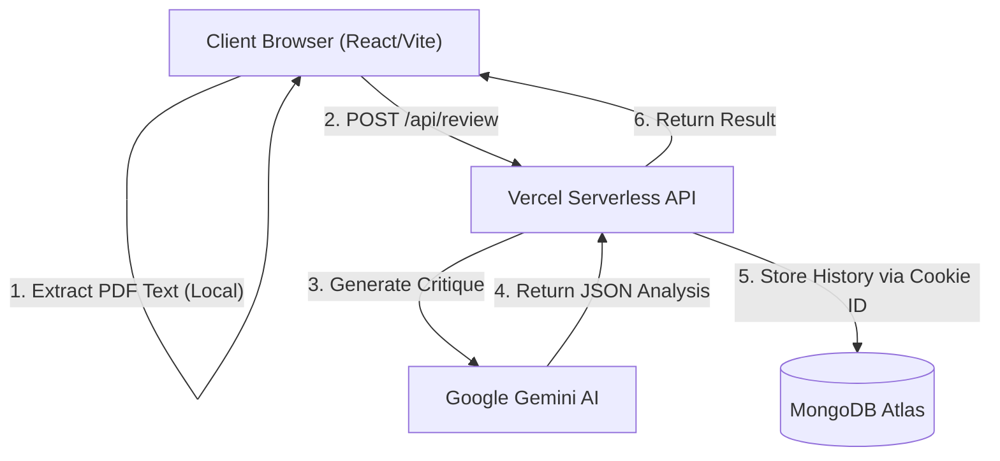

# ATS Resume Analyzer (Powered by Gemini)

A premium, serverless web application that provides instant, brutally honest AI-powered resume reviews. Built with a stunning modern glassmorphism aesthetic, it analyzes resumes against ATS (Applicant Tracking System) standards and provides actionable feedback, including automated bullet rewrites.

 _(Preview Placeholder)_

## 🧠 Architecture & Tech Stack

The platform is designed as a modern, decoupled Single Page Application (SPA) backed by serverless functions.

### System Architecture Flow



### Frontend

- **Framework:** React 18 + Vite (TypeScript)
- **Styling:** TailwindCSS with custom CSS tokens for a bespoke "Glassmorphism" design system.
- **Animations:** Framer Motion for highly optimized, buttery-smooth layout transitions and micro-interactions.
- **Routing:** Hash-based SPA routing seamlessly integrated with the browser History API.
- **State Management:** Custom React Hooks (`useReview`, `useAppTabs`, `useStats`) with localStorage hydration and Cookie-based session tracking.

### Backend & API

- **Infrastructure:** Vercel Serverless Edge/Node Functions (`api/`)
- **Database:** MongoDB (via native Node Driver) for ultra-fast, schema-less document storage of anonymous review histories and aggregated usage stats.
- **AI Engine:** Google Gemini Pro (`@google/genai`) for complex NLP tasks including ATS scoring, critique generation, and intelligent resume rewriting.
- **PDF Extraction:** Built-in PDF parsing (`pdfjs-dist`) handled securely on the client side so binary files never hit the server.

---

## ✨ Key Features

1. **Intelligent PDF Parsing:** Client-side extraction ensures blazing-fast uploads and maximum privacy.
2. **Brutal Honesty AI:** Gemini is prompted to be critical, bypassing generic advice to deliver hard-hitting, actionable improvements.
3. **Automated Bullet Rewriting:** The AI isolates weak resume bullets and provides "Before & After" rewrites.
4. **Anonymous History:** Local browser cookies sync with MongoDB to securely store user histories without requiring tedious user registration or OAuth flows.
5. **Fluid UI/UX:** A bespoke dark-mode interface featuring dynamic linear gradients, backdrop-filters, custom scrollbars, and flawless mobile responsiveness.

---

## 📁 Project Structure

```text
ats-resume-analyzer/
├── api/                    # Vercel Serverless Functions
│   ├── _db/                # MongoDB Connection Singletons
│   ├── _lib/               # Prompts & AI Configuration
│   ├── history.ts          # GET/POST User History
│   ├── review.ts           # Core Gemini AI integration endpoint
│   └── stats.ts            # Global telemetry and analytics
├── src/
│   ├── components/         # React Components
│   │   ├── features/       # Complex domain-specific views (ResultView, UploadZone)
│   │   ├── layout/         # Shell components (Header, Footer, CookieBanner)
│   │   └── ui/             # Reusable primitive elements (Buttons, Badges)
│   ├── hooks/              # Custom React Hooks for domain logic
│   ├── lib/                # Client-side utilities (PDF Extract, Types)
│   ├── services/           # API fetch wrappers
│   ├── App.tsx             # Main Application Shell
│   └── index.css           # Core Design System tokens and utility classes
├── public/                 # Static assets
└── package.json            # Unified scripts & dependencies
```

---

## 🚀 Getting Started

### 1. Prerequisites

- Node.js (v18+)
- A MongoDB cluster URL (e.g., MongoDB Atlas)
- A Google Gemini API Key

### 2. Environment Setup

Create a `.env` file in the root directory:

```env
# Google Gemini API Key
GEMINI_API_KEY=your_gemini_api_key_here

# MongoDB Connection String
MONGODB_URI=mongodb+srv://<user>:<password>@cluster.mongodb.net/?retryWrites=true&w=majority
```

### 3. Installation

Install all dependencies using npm:

```bash
npm install
```

### 4. Running Locally

This project uses the Vercel CLI locally to properly route API requests to the `/api` directory while simultaneously serving the Vite frontend.

```bash
# This will start BOTH the Vite frontend and the Vercel serverless functions
npm run dev
```

The application will be available at `http://localhost:3000`.

_(Note: The custom `scripts/start-dev.js` safely bridges the Vite environment with the Vercel dev environment to prevent recursive invocation errors)._

---

## 🧪 Testing Architecture

Quality is ensured through a comprehensive, Behavior-Driven Development (BDD) testing suite designed for robust, end-to-end coverage without relying on live backend servers or real Gemini API credits.

### Testing Stack

- **Test Runner & Browser Automation:** Playwright
- **BDD Framework:** Cucumber (via `playwright-bdd`) for readable `.feature` files.
- **API Testing:** Mock Service Worker (MSW) used natively inside Playwright to intercept and test all `/api/*` Vercel function calls seamlessly at the network layer.

### Running Tests

To execute the test suite in headless mode:

```bash
npm test
```

To run the tests with the Playwright UI (useful for debugging and tracing):

```bash
npm run test:ui
```

All tests are written in plain English using Gherkin syntax (located in `__test__/playwright/features/`) and mapped to underlying TypeScript step definitions.

---

## ☁️ Deployment

This project is optimized for zero-config deployment on **Vercel**.

1. Connect your GitHub repository to Vercel.
2. Ensure the framework preset is detected as **Vite**.
3. Add `GEMINI_API_KEY` and `MONGODB_URI` to your Vercel Environment Variables.
4. Deploy! Vercel will automatically build the `src` directory and deploy the `api/` directory as serverless functions.

---

## 🎨 Design Philosophy

The UI is intentionally designed to feel like a premium, native application rather than a standard web form.

- **Typography:** Uses the `Kanit` font family for bold, tech-forward headings and `Inter` for highly legible body copy.
- **Glassmorphism:** Heavy use of `backdrop-blur`, semi-transparent borders (`border-white/10`), and deep drop-shadows to create physical depth.
- **Layout:** Flexbox and strict `max-h` constraints ensure the application behaves like a standalone app window, locking the viewport and utilizing internal, hidden scrollbars for content overflow.

---

_Architected and developed by Kishor Annamalai._
